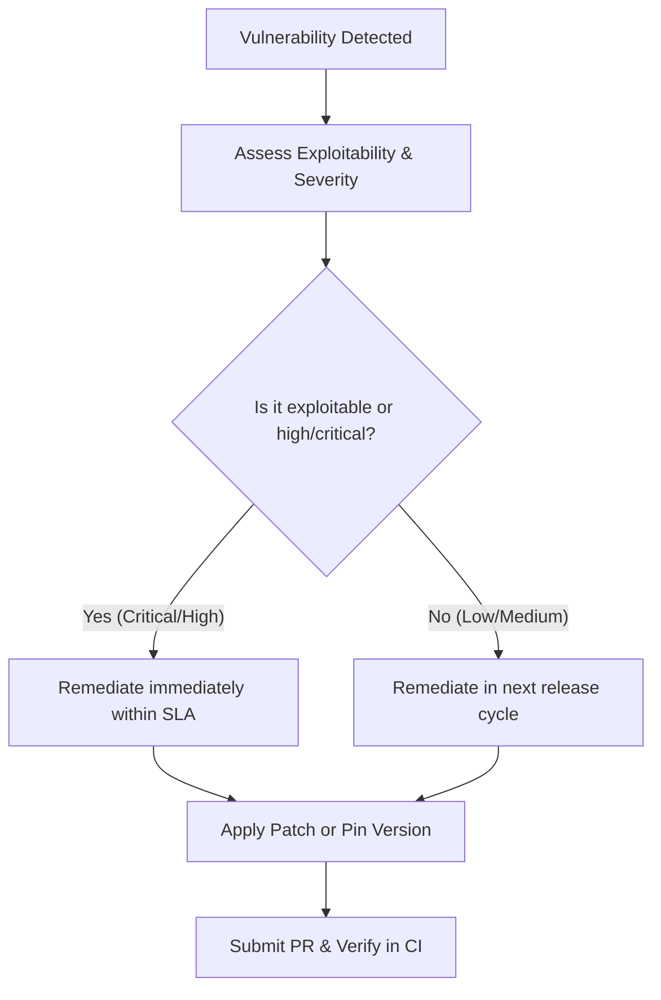

# Security Policy & Vulnerability Response

This document outlines the security policy for TariffShield, including the vulnerability response workflow, procedures for patching dependencies, and Service Level Agreements (SLAs) for addressing security issues.

---

## 1. Security Commitment
TariffShield processes real financial transactions and handles sensitive importer customs data. Securing our dependency tree and codebase is a top priority. Automated security scans (`cargo-audit`, `npm-audit`, and `cargo-deny`) run on every pull request and daily at 06:00 UTC.

---

## 2. Vulnerability Response Workflow

When a dependency vulnerability is detected (either in a pull request or via a scheduled daily CI run), the following response workflow must be initiated immediately:



### Step 1: Assessment
The first step is to assess the vulnerability's impact on TariffShield:
1. **Identify the Severity**: Determine the CVSS score and severity level (Critical, High, Medium, Low).
2. **Determine Exploitability**: Analyze if the vulnerable code path is actually reachable and used in TariffShield.
   - For example, if a vulnerability exists in a CLI utility of an NPM package that we only use for development, the runtime impact is minimal.
   - If the vulnerability is in a core library (e.g., cryptographic library used in our Soroban contract or Express API routing), the impact is critical.

### Step 2: Remediation (Patch or Pin)
Once assessed, remediate the dependency according to its ecosystem:

#### Rust / Cargo Dependencies
1. **Patch Transitive Dependencies**: If the vulnerability is in a transitive dependency, try updating the package using Cargo's update mechanism:
   ```bash
   cargo update -p <vulnerable-crate-name>
   ```
   This will update the lockfile to the latest compatible semver version.
2. **Upgrade Direct Dependencies**: If the vulnerability is in a direct dependency and requires a major/minor version bump, edit the dependency version in [Cargo.toml](file:///Users/favoureze/TariffShield/Cargo.toml) or the contract's Cargo.toml and run:
   ```bash
   cargo build
   ```
3. **Ignore Non-Exploitable Advisories**: If an advisory is verified to be completely non-exploitable in our context, it can be temporarily ignored by adding it to the `ignore` list in the `audit.toml` or using the `--ignore` flag in local development.

#### NPM / Node.js Dependencies
1. **Automated Fixes**: Run `npm audit fix` to automatically update packages to non-vulnerable versions.
2. **Manual Upgrades**: If `npm audit fix` cannot resolve it without breaking changes, manually upgrade the package in the workspace:
   ```bash
   npm install <package-name>@latest --workspace=<workspace-name>
   ```
3. **Dependency Overrides**: If the vulnerability is in a deep transitive dependency and the parent package has not been updated, use the `overrides` field in the root [package.json](file:///Users/favoureze/TariffShield/package.json) to force a specific version:
   ```json
   "overrides": {
     "vulnerable-package": "^1.2.3"
   }
   ```
   After updating `package.json`, run `npm install` to regenerate the lockfile.

---

## 3. Service Level Agreements (SLAs)

To ensure a rapid response to security threats, TariffShield enforces the following SLAs for vulnerability mitigation:

| Severity Level | CVSS Score Range | Mitigation SLA | Description |
|---|---|---|---|
| **Critical** | 9.0 – 10.0 | **24 Hours** | Critical vulnerabilities must be patched, mitigated, or hotfixed within 24 hours of detection. |
| **High** | 7.0 – 8.9 | **3 Days** | High vulnerabilities must be addressed within 3 days. |
| **Medium** | 4.0 – 6.9 | **14 Days** | Medium-severity vulnerabilities should be resolved in the next scheduled release cycle. |
| **Low** | 0.1 – 3.9 | **30 Days** | Low-severity vulnerabilities should be monitored and updated during regular maintenance. |

*Note: The SLA clock begins when the vulnerability is first flagged by the automated CI schedule or disclosed publicly.*

---

## 4. CodeQL Static Analysis (SAST)

GitHub's CodeQL scans every pull request and runs a weekly full-repo baseline on Mondays at 03:00 UTC.

### Configuration

| Setting | Value |
|---------|-------|
| Workflow | `.github/workflows/codeql.yml` |
| Config file | `.github/codeql/codeql-config.yml` |
| Query suite | `security-and-quality` (catches both security vulnerabilities and code-quality issues) |
| Languages | `javascript-typescript` |
| Schedule | Weekly — Monday 03:00 UTC |
| PR trigger | Every pull request targeting `main` or `master` |

The config file excludes `node_modules`, `dist`, `.next`, and generated files to reduce false positives.

### Viewing alerts

Code scanning alerts appear in **Security → Code scanning alerts** in the GitHub repository. Each alert includes:

- The vulnerable code location and a description of the issue
- A severity level (`error`, `warning`, `note`, or `recommendation`)
- A suggested fix where available

### Triaging alerts

Before closing an alert as a false positive or "won't fix":

1. Reproduce the potential attack path in a local environment.
2. Confirm whether the code path is reachable from an untrusted input source.
3. If the alert is a genuine false positive, dismiss it with the reason **False positive** and add a comment explaining why.
4. If the issue is real, open a remediation PR and reference the alert URL in the PR description.

Alerts of severity **error** automatically fail the PR code-scanning check. **Warning** level alerts appear as annotations but do not block merge.

---

## 5. Reporting a Security Vulnerability

If you discover a security vulnerability in TariffShield, do not open a public GitHub issue. Instead, please report it privately via email to `security@tariffshield.com` or follow our coordinated disclosure policy.
